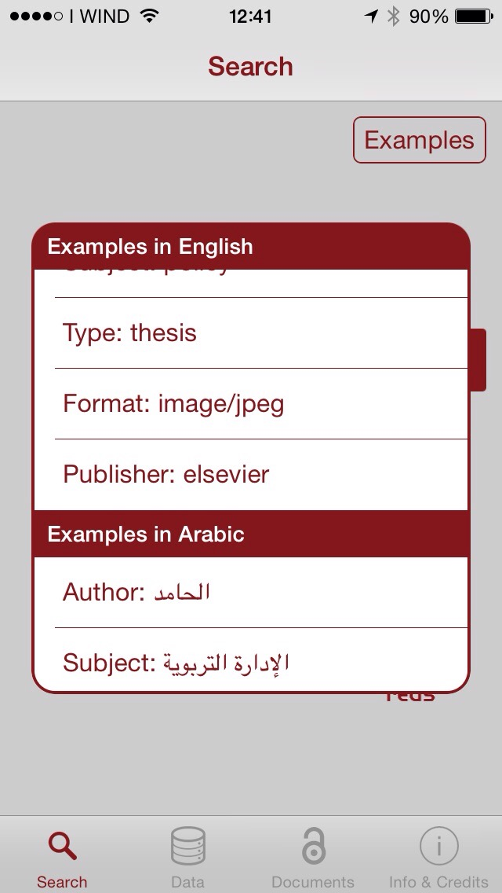

*************************************
Semantic Search Mobile (v. 2.0.1) 
*************************************

============
About
============
.. _PROJECT-URL:  https://www.chain-project.eu
.. _SG-URL: https://earthserver-sg.consorzio-cometa.it/
.. _PLAY: https://play.google.com/store/apps/details?id=it.infn.ct.semanticsearch
.. _ITUNES: https://itunes.apple.com/us/app/semantic-search/id816377831?ls=1&mt=8

  

**Semantic Search Mobile** is a mobile application that allows to browse the almost 3,100 Open Access Data and Documents Repositories integrated in the `CHAIN-REDS <https://www.chain-project.eu>`_ project's Knowledge Base, presented either through geographic maps or table.
Tapping on a marker on a map or on an element of a table, one gets redirected to the corresponding repository in order to search inside it. The app also allows to use the CHAIN-REDS Semantic Search Engine to search across the more than 30 million resources contained in the Knowledge Base and enriched by means of Semantic Web technologies. For each record found, a short description of the corresponding resource is provided. Tapping on an element of the list, one can access a detailed view with direct links to the document and, if existing, to the related data. 

   
============
Installation
============

To install Semantic Search Mobile on your devices simply download the app from the store:

|PLAY-STORE| |APP-STORE| 

.. |PLAY-STORE| image:: images/google_play_icon.png
   :align: middle 
   :target: PLAY_
   :alt: Semantic Search Mobile play store
   :scale: 100%

.. |APP-STORE| image:: images/app-store-logo.jpg
   :align: middle
   :target: ITUNES_
   :alt: Semantic Search Mobile app store
   :scale: 100%

============
Usage
============

Once the application is installed on you mobile appliance, the user can select the possible filters (according to the Dublin Core Standard) like : dc: author, dc: subject dc: type and dc: publisher. 

Once choosed the filter (for example "title") typing one or more keywords in the textbox search, clicking the "Search" button the system submit a `REQUEST (HTTP) <https://github.com/csgf/semantic-search-api>`_ to get the list of resources that contain the searched keyword inside the title.

Clicking the "Examples" button are show examples of search filters in 4 of the 110 languages supported by the system.

In both cases the results of the request will be processed to obtain the final results, as shown in Figure

Tapping on Data or Documents the application shows the Data or Documents Repositories in geographic map or in list format.

.. image:: images/Mobile_OADR.png
   :align: center  
   :scale: 50%

============
References
============

============
Support
============

Please feel free to contact us any time if you have any questions or comments.

.. _INFN: http://www.ct.infn.it/
.. _DFA: http://www.dfa.unict.it/

:Authors:
 
 

 `Roberto BARBERA <mailto:roberto.barbera@ct.infn.it>`_ - Italian National Institute of Nuclear Physics (INFN_),
 `Rita Ricceri <mailto:rita.ricceri@ct.infn.it>`_ - Italian National Institute of Nuclear Physics (INFN_), 
 `Mario TORRISI <mailto:mario.torrisi@ct.infn.it>`_ - University of Catania (DFA_) `Giuseppina INSERRA <mailto:giuseppina.inserra@ct.infn.it>`_ - Italian National Institute of Nuclear Physics (INFN_), `Carla CARRUBBA <mailto:carla.carrubba@ct.infn.it>`_ - Italian National Institute of Nuclear Physics (INFN_)

:Version: v2.6.0, 2015

:Date: June 17th, 2015 19:00